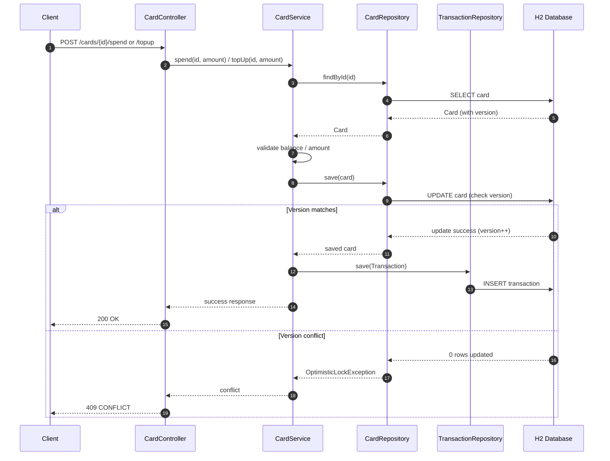

# Card Issuance Platform

A backend service built using **Spring Boot** that simulates a **virtual card issuance system**.  
This project demonstrates core backend engineering concepts including **REST API design, transactional integrity, concurrency handling, and testing**.

Designed to reflect **real-world backend patterns** expected from an **SDE-1 / Junior Backend Engineer**.

---

## Features

- Create virtual cards with an initial balance
- Spend from a card with balance validation
- Top-up card balance
- View transaction history per card
- Prevent race conditions using **optimistic locking (`@Version`)**
- REST APIs with proper HTTP status codes
- In-memory H2 database
- Unit, integration, and concurrency tests

---

## High-Level Architecture

```
Client (REST)
│
▼
Controller Layer
│
▼
Service Layer (@Transactional)
│
▼
Repository Layer (JPA)
│
▼
H2 Database
```

---

## Execution Flow (Spend / Top-up)



---

## Concurrency Handling (Optimistic Locking)

The `Card` entity contains a `@Version` field:

- Hibernate checks the version on every update
- If multiple concurrent updates occur:
  - One succeeds
  - Others fail with `ObjectOptimisticLockingFailureException`

This prevents lost updates and negative balances without using database locks.

---

## Testing Strategy

### Unit & Integration Tests

- Card creation
- Valid and invalid spend operations
- Top-up functionality
- Transaction history retrieval

### Concurrency Test

- Uses `ExecutorService` and `CountDownLatch`
- Simulates concurrent spend requests
- Asserts:
  - No data corruption
  - Balance remains consistent
  - At least one operation succeeds

Tests validate correctness and consistency, not deterministic execution order.

---

## API Endpoints

### Create Card
```http
POST /cards
```
```json
{
  "cardholderName": "Alice",
  "initialBalance": 100
}
```

### Spend from Card
```http
POST /cards/{id}/spend
```
```json
{
  "amount": 30
}
```

### Top-up Card
```http
POST /cards/{id}/topup
```
```json
{
  "amount": 50
}
```

### Get Card Details
```http
GET /cards/{id}
```

### Get Transaction History
```http
GET /cards/{id}/transactions
```

---

## 🗄️ Database Model

### Card
- `id`
- `cardholderName`
- `balance`
- `createdAt`
- `version` (for optimistic locking)

### Transaction
- `id`
- `card` (Many-to-One)
- `amount`
- `type` (SPEND / TOPUP)
- `createdAt`

---

## How to Run

```bash
mvn clean spring-boot:run
```

**H2 Console:**
```
http://localhost:8080/h2-console
```

---

## How to Run Tests

```bash
mvn clean test
```

---

## Design Decisions

- **Optimistic locking** (`@Version`) is used to handle concurrent balance updates safely without blocking database rows
- Transaction boundaries are defined at the service layer
- Read-only transactions are used for fetch operations
- Monetary values use `BigDecimal`; comparisons use `compareTo()` to avoid scale issues
- Concurrency tests validate data consistency, not execution order

---


## Tech Stack

- Java 17  
- Spring Boot  
- Spring Web MVC  
- Spring Data JPA (Hibernate)  
- H2 (in-memory database)  
- JUnit 5 + MockMvc  
- Maven  

---

